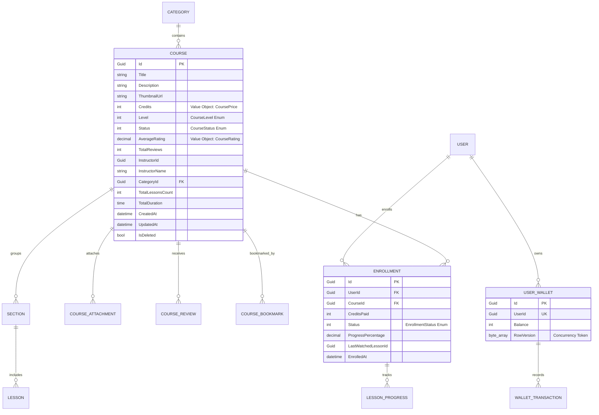

# Course & Enrollment Subsystem — Complete Technical Documentation

> **Subsystem**: Course Management, Catalog Search, Virtual Wallet & Atomic Enrollment  
> **Architecture**: Clean Architecture, Domain-Driven Design (DDD), CQRS with MediatR, EF Core (SQL Server), Redis Caching  

---

## 1. Subsystem Overview

The **Course & Enrollment Subsystem** is the core learning backbone of Skill Loop. It provides:
1. **Course Lifecycle Management**: Course creation, sections/lessons curation, multimedia assets (videos, PDFs), rating recalculation, and publishing workflows.
2. **Advanced Search & Catalog Filtering**: Multi-field search (title, description, instructor), category filtering, difficulty level, credits threshold, minimum rating, and customizable sorting.
3. **Virtual Currency & Atomic Enrollment**: Integration with the user's `UserWallet`, enforcing balance invariants and executing atomic credit deduction prior to access grant.
4. **Learning Progress Tracker**: Tracking per-lesson completions, calculating total progress percentages, and auto-completing enrollments.
5. **High-Performance Redis Caching**: Read-heavy optimization using Cache-Aside patterns, tag-based/prefix invalidations triggered by Domain Events.

---

## 2. Domain Model & ERD Mapping

### Aggregates & Entities

---

## 3. CQRS Use Cases & API Endpoints

### 3.1 Course Endpoints (`api/v1/courses`)

| Method | Endpoint | Description | Auth |
|---|---|---|---|
| `GET` | `/api/v1/courses` | Paged search, filter, and sort (Cached in Redis) | Public |
| `GET` | `/api/v1/courses/{id}` | Course details and syllabus outline (Cached) | Public |
| `POST` | `/api/v1/courses` | Create a new course (Draft status) | Authorized |
| `POST` | `/api/v1/courses/{id}/publish` | Publish course to catalog | Authorized |
| `POST` | `/api/v1/courses/{id}/sections/{sectionId}/lessons` | Add lesson with video to section | Authorized |
| `POST` | `/api/v1/courses/{id}/reviews` | Submit a course star rating & review | Authorized |
| `POST` | `/api/v1/courses/{id}/bookmark` | Toggle course bookmark in user list | Authorized |

### 3.2 Enrollment Endpoints (`api/v1/enrollments`)

| Method | Endpoint | Description | Auth |
|---|---|---|---|
| `POST` | `/api/v1/enrollments/enroll` | Atomically deduct credits & enroll user | Authorized |
| `GET` | `/api/v1/enrollments/my-courses` | Get all enrolled courses for current user | Authorized |
| `POST` | `/api/v1/enrollments/{courseId}/lessons/progress` | Mark lesson completed & update progress % | Authorized |

### 3.3 Categories Endpoint (`api/v1/categories`)

| Method | Endpoint | Description | Auth |
|---|---|---|---|
| `GET` | `/api/v1/categories` | Retrieve all categories with published course counts | Public (Cached) |

---

## 4. Redis Caching & Invalidation Architecture

### Cache Strategy
- **Catalog Search**: Key format `courses:paged:q={term}:cat={catId}:lvl={level}:maxP={credits}:minR={rating}:sort={sort}:p={page}:s={size}` (TTL: 10m sliding, 1h absolute).
- **Course Detail**: Key format `courses:detail:{courseId}` (TTL: 30m sliding, 4h absolute).
- **Categories**: Key format `categories:all` (TTL: 1h sliding, 24h absolute).

### Event-Driven Invalidation
The subsystem implements domain event notifications wrapped via `DomainEventNotification<TEvent>` and processed by [`CourseInvalidationHandler`](file:///d:/Skill-Loop-Backend/Skill-Loop-Backend/src/Skill-Loop.Application/Features/Courses/EventHandlers/CourseInvalidationHandler.cs):
1. `CourseCreatedDomainEvent` -> Invalidates `courses:paged:*` & `categories:all`.
2. `CourseUpdatedDomainEvent` -> Invalidates `courses:detail:{courseId}` & `courses:paged:*`.
3. `CoursePublishedDomainEvent` -> Invalidates `courses:detail:{courseId}`, `courses:paged:*`, & `categories:all`.

---

## 5. Virtual Wallet & Atomic Concurrency

To prevent race conditions during credit deduction and course enrollment:
1. `UserWallet` uses **Optimistic Concurrency Control** via `byte[] RowVersion` (`IsRowVersion()` in EF Core).
2. The entire operation executes within a single unit of work (`AppDbContext.SaveChangesAsync`).
3. Outbox domain events are persisted in the same transaction for reliable background notifications and analytics.
